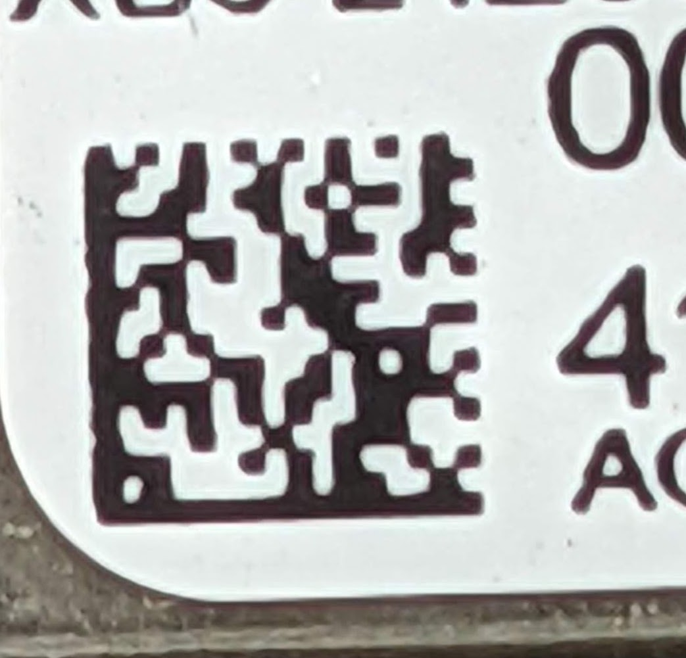

## Demonstration of three utilities for Data Matrix and QR Codes

You've probably seen these little QR Code looking symbols on pcbs, processors, or other components used in
your electronics projects. While they look like qr codes they are actual DATA MATRIX symbols, so qr code libraries
can't decode them. Here is more info on data matrix symbols: https://en.wikipedia.org/wiki/Data_Matrix

This project uses `opencv` to capture an image of the data matrix symbol, `pylibdmtx` to decode the data, then `qrcode`
to generate a qr code holding the same data. The original image captured by the camera is stored in `/camera_images`
and the new qr code is saved to `/qrcodes`. Finally, `opencv` is used again to test the newly generated qr code
data against the data matrix data.

The code is structured so you can simply copy/paste the functions if you need only one portion of the functionality.

Although it wasn't necessary to solve the data matrix problem, I also included a simple example
using `opencv` and `pyzbar` to read multiple qr codes from a video camera and store save the data values to a file.
I came across this snippet during my search and felt that it belonged here. This code came from:

- https://towardsdatascience.com/building-a-barcode-qr-code-reader-using-python-360e22dfb6e5

### Documentation for the libraries used

Decode data matrix symbols using pylibdmtx library and opencv.

- https://pypi.org/project/pylibdmtx/
- https://pypi.org/project/opencv-python/

Generate QR codes using qrcode library.

- https://pypi.org/project/qrcode/#data

Read QR codes with video camera using pyzbar library and opencv

- https://pypi.org/project/pyzbar/
- https://pypi.org/project/opencv-python/
- https://towardsdatascience.com/building-a-barcode-qr-code-reader-using-python-360e22dfb6e5

---

### My problem:

I wanted an easy way to get the serial number from a part being used in a project. This serial number was being used
as the unique id for the assembled product. I figured that this little symbol probably held the necessary data.
The problem was that this is actually a DATA MATRIX symbol....and they are super small. The symbol in the image below
is only about 2.5 mm square.

For testing, I had to take a photo of the data matrix then zoom and display my phone to the camera. I've left a couple 
examples of this in the `camera_images` and `failed_image_captures` folders.

In production, an inexpensive USB digital microscope is being used....
[like this one](https://www.amazon.com/Microscope-ANNLOV-Electronic-Magnification-Adjustable/dp/B084HJ44J5/ref=sr_1_14?crid=2A1MVESL0BR51&keywords=coin+inspection+camera&qid=1637548136&qsid=137-0052057-0876551&sprefix=coin+ins%2Caps%2C224&sr=8-14&sres=B08CZCH2PP%2CB0928Q3T42%2CB081J3LN61%2CB07TV2BFVR%2CB07C9C6P5D%2CB0819Q2YLK%2CB08PTVBGBQ%2CB01MYTHWK4%2CB081RFWHTJ%2CB084HJ44J5%2CB08NJ8627V%2CB071HYRPND%2CB08DR573QL%2CB08MPXNW76%2CB09HX29ZKG%2CB07PN9N21Z&srpt=MICROSCOPES)

---

### Data Matrix Symbol

### QR Code of the same data

